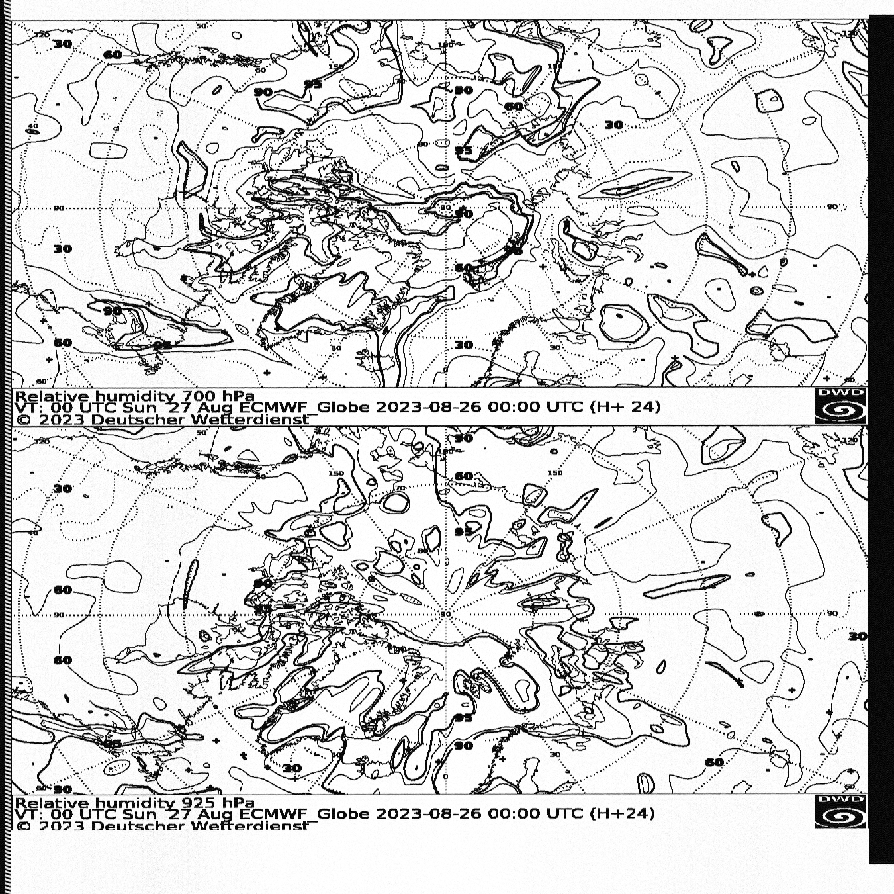

# Decoding Weatherfax in Python

A Python script decoding USB radio signals recorded as WAV files
to images. The recordings need to start with at least
10s of synchronization pulses.
 

All contents of this repo are for educational purposes.
Copyright of the faxed material belongs to the transmitting agencies.

#### Example outputs:

